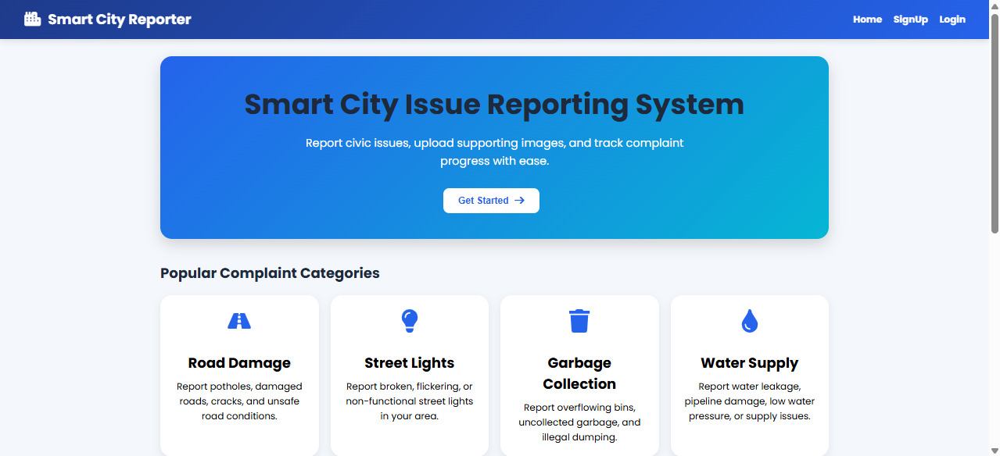
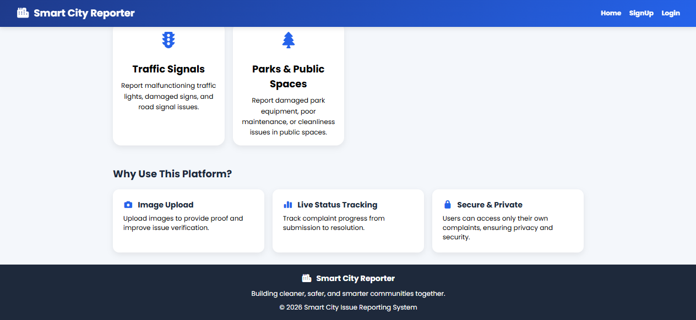
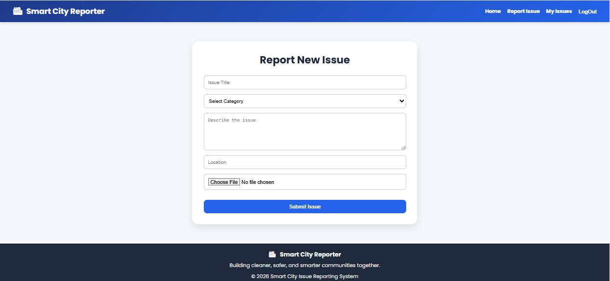
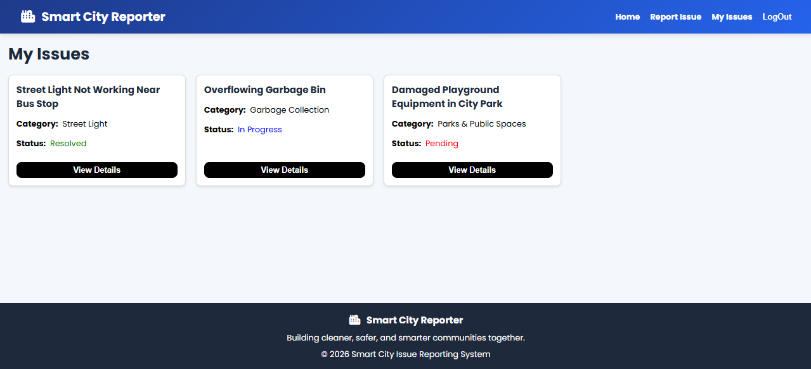
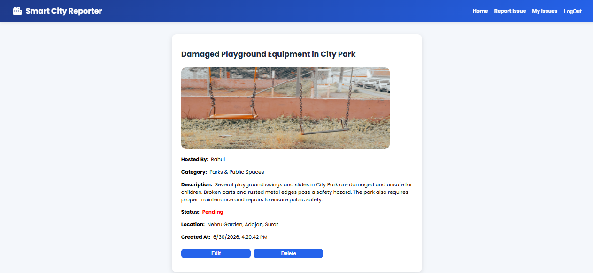
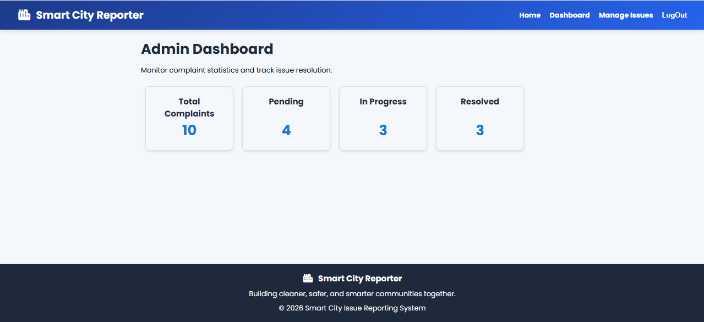
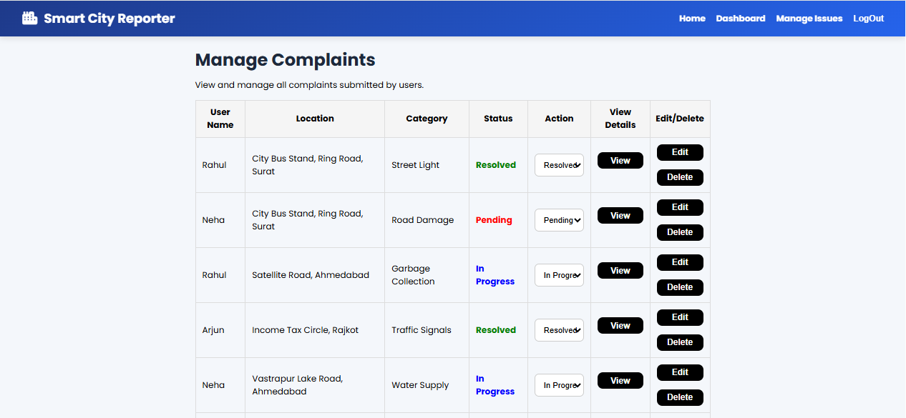

# Smart City Issue Reporting System

A full-stack MERN web application that enables citizens to report civic issues such as potholes, garbage, water leakage, street light failures, road damage, and other public infrastructure problems.

Users can report issues with images, track complaint status, manage their own complaints, and administrators can efficiently monitor and resolve reported issues through a secure admin dashboard.

## Features

### User
- User Registration and Login using JWT Authentication
- Report Civic Issues with Image Upload
- View All Reported Issues
- View Detailed Information About Individual Issues
- Edit and Delete Own Complaints
- Track Complaint Status (Pending / In Progress / Resolved)

### Admin
- Secure Admin Dashboard
- View All Reported Issues
- Update Complaint Status
- Manage User Complaints Efficiently

### User Experience
- Responsive User Interface
- Form Validation
- Image Preview Before Upload

## Tech Stack

### Frontend

- React.js
- React Router
- Axios
- Formik
- React Bootstrap
- CSS

### Backend

- Node.js
- Express.js

### Database

- MongoDB Atlas
- Mongoose

### Authentication & Authorization

- JWT Authentication
- Role-Based Authorization

### Storage

- Cloudinary
- Multer

### Deployment

- Render *(Add after deployment)*

## Screenshots

### Home Page (Top Section)



### Home Page (Bottom Section)



### Report Issue



### My Complaints


### Complaint Details



### Admin Dashboard



### Manage Complaints



## Installation

```bash
git clone https://github.com/HetviGonawala/smart-city-issue-reporting-system.git

cd smart-city-issue-reporting-system
```

### Backend

```bash
cd backend
npm install
```

Create a `.env` file inside the **backend** folder.

```env
MONGO_URL=your_mongodb_connection_string

JWT_SECRET=your_jwt_secret

CLOUD_NAME=your_cloudinary_cloud_name
CLOUD_API_KEY=your_cloudinary_api_key
CLOUD_API_SECRET=your_cloudinary_api_secret
```

Start the backend server.

```bash
npm run dev
```

### Frontend

```bash
cd frontend
npm install
npm run dev
```

## Author

**Hetvi Gonawala**

**GitHub:** [Hetvi Gonawala](https://github.com/HetviGonawala)

**LinkedIn:** [Hetvi Gonawala](https://www.linkedin.com/in/hetvi-gonawala-aa400b411/)

## License

This project is developed for educational and portfolio purposes.